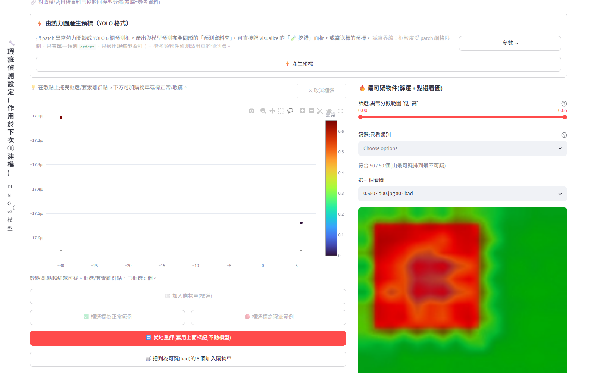
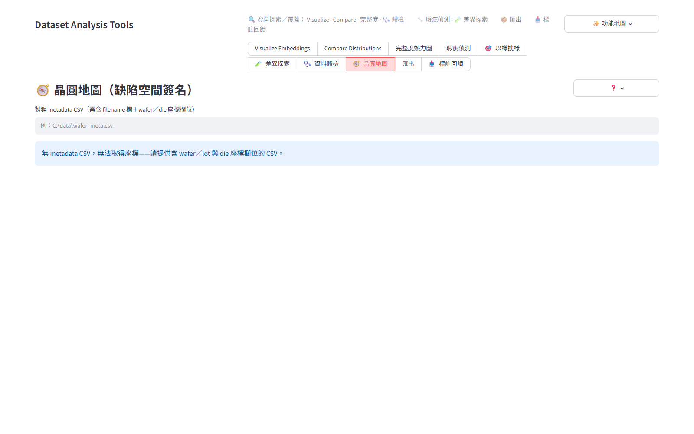
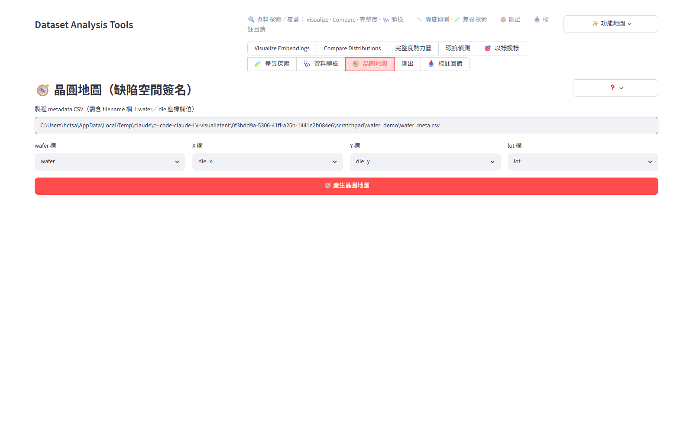
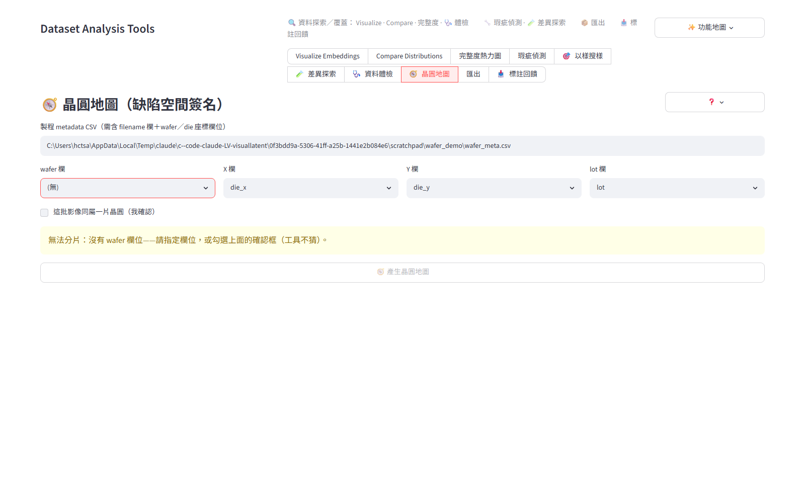
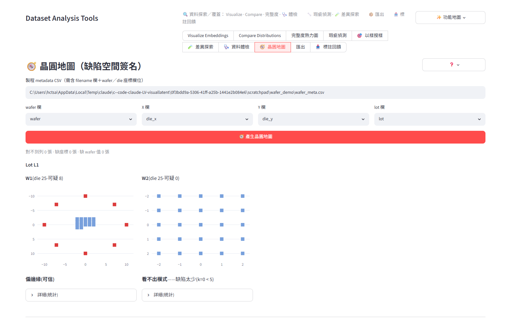
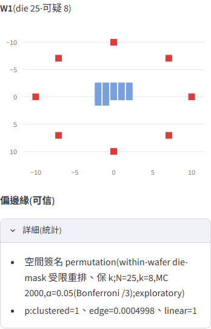
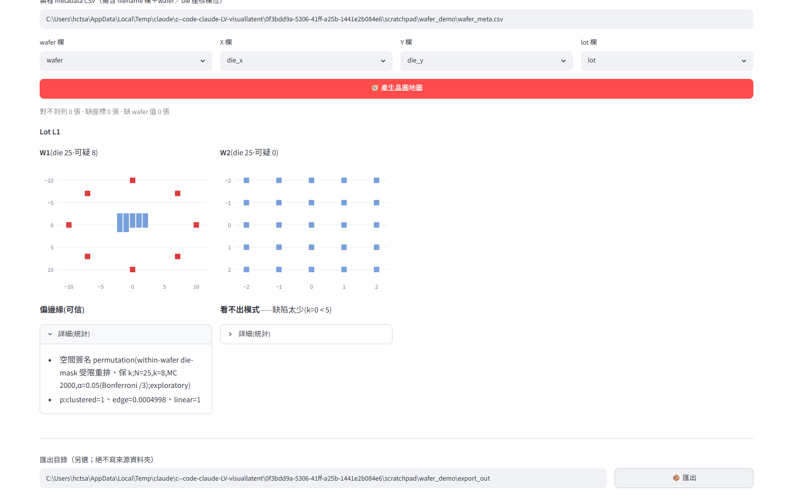

# 🧭 晶圓地圖(缺陷空間簽名)使用教學

> 以真實畫面截圖示範完整流程(截圖由 E2E 驅動腳本在示範資料上實拍,2026-07-19)。
> 功能設計:[3_Architect_Design/M22_gui_wiring.md](../../3_Architect_Design/M22_gui_wiring.md);
> 需求背景:[1_user_needs/wafer_spatial_signature.md](../../1_user_needs/wafer_spatial_signature.md)。

## 這個工具做什麼

把「瑕疵偵測②」逐 die 的判定**攤回晶圓座標**,一眼看出缺陷的空間模式:

| 結論 | 意義 | 常見根因方向 |
|------|------|--------------|
| **聚一團(可信)** | 缺陷集中在某一區 | 局部污染、曝光局部問題 |
| **偏邊緣(可信)** | 缺陷偏在晶圓外圈 | 塗佈/蝕刻邊緣效應 |
| **線狀(可信)** | 缺陷連成一條線 | 機械刮傷(手臂/夾具) |
| **看不出模式** | 隨機散佈或樣本不足 | 大概率非系統性問題 |
| 同 lot 多片同模式 | (自行並排比對) | 該批共用設備/程序 |

**誠實原則**:判定用 within-wafer permutation 校準(只在這片實際存在的 die 位置間
重排),隨機資料就說隨機、樣本太少就說看不出來——說「有模式」時才值得叫工程師來看。

## 事前準備:兩樣東西

1. **瑕疵偵測②的套用結果**(本工具的判定來源)。
2. **一張 metadata CSV**,一列對一張影像,至少含:

```csv
filename,wafer,die_x,die_y,lot
n00.jpg,W1,-2,-2,L1
d00.jpg,W1,10,0,L1
...
```

- `filename`(必要):影像檔名,用來和資料夾裡的影像對起來。
- 座標兩欄(必要):常見欄名 `die_x/die_y`、`x/y`、`col/row` 會被自動認出。
- `wafer` 欄(建議):哪一片晶圓;`wafer_id`、`wafer_no`、`晶圓`、`片號` 也認得。
- `lot` 欄(選填):批號,有給才有「同 lot 並排」。
- **欄名不合以上也沒關係**——畫面上四個下拉可以手動指定任何欄。

## 步驟 1:先跑瑕疵偵測 ②(前置)

「瑕疵偵測」→ ① 建模(或載入既有模型)→ ② 加目標資料夾 → 套用偵測。
建議在②先確認幾個樣本(或按「自動把最不可疑的 12 個標為正常範例」)→
「🔁 就地重評」,讓判定經過校準再攤圖。



## 步驟 2:切到「🧭 晶圓地圖」

工具列點「🧭 晶圓地圖」。還沒給 CSV 時,它會明講缺什麼(**不會**畫任何假圖):



## 步驟 3:貼上 CSV 路徑 → 欄位自動對應

貼上 CSV 路徑後,四個欄位下拉會**自動猜**(猜錯直接改;換一份 CSV 會重新猜):



### 如果資料沒有 wafer 欄位?

工具**不做任何假設**:它會鎖住產生鈕並明講「無法分片」。只有你親手勾選
「這批影像同屬一片晶圓(我確認)」——這是**你的斷言**,不是工具的猜測——才會
當成單片分析(結果會標示「(單片)」):



同理:CSV 缺座標欄 → 明講「缺座標欄位」;完全沒 CSV → 明講;缺 lot 欄 →
只是收起並排功能。**缺哪層,它就停在哪層告訴你**,永遠不會默默硬畫。

## 步驟 4:產生晶圓地圖

按「🧭 產生晶圓地圖」。每片一張地圖(🟥 可疑 die、🟦 正常 die,座標即 CSV 座標),
下方一句結論;同 lot 的片子排在一起;上方灰字明講「對不到列/缺座標/缺 wafer 值」
各幾張(0 也照報,絕不默默少畫):



此例(示範資料):W1 的 8 顆可疑 die 圍成外圈 → **偏邊緣(可信)**;
W2 沒有可疑 die → **看不出模式——缺陷太少**(誠實說不知道,而不是硬給結論)。

## 步驟 5:看統計細節(選看)

每片地圖下的「詳細(統計)」可展開 method line 與三個簽名各自的 p 值——
跟主管或工程師對「多有把握」時用;平常看粗體結論即可:



> 判定門檻(保守設計):die ≥20、可疑 ≥5、正常 ≥5 才進統計;
> 三簽名做 Bonferroni 校正;結論屬**探索性**(exploratory),當根因線索用,
> 不是嚴格推論。

## 步驟 6:匯出貼報告

最下方填一個**另選的**輸出資料夾(工具絕不寫來源資料夾)→「📦 匯出」:



會得到:
- `wmap_<wafer>.png` — 每片一張點陣晶圓地圖(紅=可疑、藍=正常)
- `wafer_signatures.csv` — 每片一列:wafer_id、lot、n、k、verdict、三個 p 值、理由

## 常見問題

- **「看不出模式」是壞事嗎?** 不是——多數晶圓本來就該隨機。這個「不亂報」正是
  結論可信的原因(狼來了工具沒人信)。
- **抽檢(不是每顆 die 都有影像)可以用嗎?** 可以,有幾顆畫幾顆;統計 null 也只在
  「實際存在的檢測點」之間重排,不會因為抽檢位置偏(例如只檢外圈)就誤報偏邊緣。
- **一片晶圓要多少樣本?** die ≥20、其中可疑與正常各 ≥5,結論才會出統計;不足時
  地圖照畫、結論誠實寫「看不出模式+原因」。
- **同一批很多片怎麼看?** 給 lot 欄 → 自動並排(每列 4 片、每 lot 最多顯示 12 片,
  超過會明講),掃一眼找「同模式的片子」。
- **會動到我的資料或設定嗎?** 不會:只讀來源資料夾與②結果;匯出只寫你另選的目錄。
